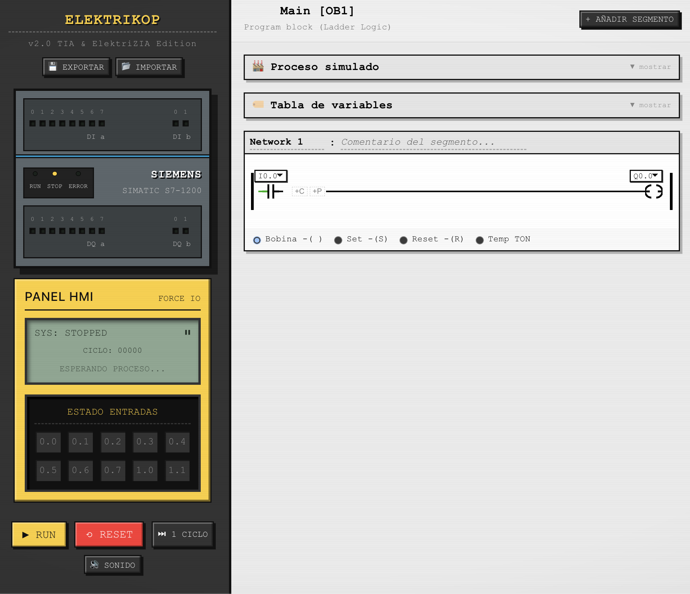

# ElektriKOP

**Emulador de lógica de escalera (KOP) para estudiantes de automatización industrial — 100% en español, gratuito y de código abierto.**

  

### 🔗 [Pruébalo ahora en kop.elektrizia.com](https://kop.elektrizia.com) — sin instalar nada

---

## ¿Qué es ElektriKOP?

ElektriKOP es un simulador visual de lógica de escalera (KOP / Ladder Diagram) inspirado en el entorno de programación de un PLC Siemens S7-1200. Permite montar segmentos de automatización — contactos, bobinas, temporizadores, enclavamientos — y ver en tiempo real cómo fluye la corriente por el circuito, sin necesitar TIA Portal, licencias, ni hardware real.

Está pensado para **estudiantes de ciclos de automatización y electricidad** (como el certificado de profesionalidad ELEE0109), profesores que quieran una herramienta de apoyo en clase, o cualquiera que quiera entender cómo piensa un PLC antes de sentarse delante del software industrial de verdad.

## Por qué existe

TIA Portal es el estándar de la industria, pero tiene barreras de entrada reales para un estudiante:

- Licencia de pago (o de campus, con acceso limitado).
- Solo corre en Windows — un dolor de cabeza en Mac o Linux.
- La curva de entrada es alta si lo primero que ves es el software completo, con todas sus opciones.

ElektriKOP no sustituye a TIA Portal — es un compañero de estudio: un sitio donde equivocarte gratis, entender por qué un circuito no enclava, y coger intuición sobre lógica de escalera antes de enfrentarte al programa real.

## Características

**Editor KOP**
- Segmentos con contactos en serie y en paralelo (ramas anidadas, sin límite artificial de profundidad).
- Contactos NA / NC / flanco positivo (P) / flanco negativo (N), conmutables con un clic.
- Bobina directa, SET, RESET, **bloque SR/RS combinado** (bistable con prioridad invertible: Reset domina o Set domina, con su propia rama de entrada R1), temporizadores TON/TOF/TP y contadores CTU/CTD — elegibles con clic o **arrastrando** el tipo de instrucción hasta la salida del segmento.
- **Arrastrar y soltar** dentro del esquema: inserta contactos/bloques paralelos en cualquier posición, o mueve uno ya colocado a otra rama, con zonas de aterrizaje visuales mientras arrastras.
- Visualización en tiempo real del flujo de corriente por el circuito, como en TIA Portal.
- Detección de direcciones de salida duplicadas entre segmentos (evita bugs típicos de principiante).

**Bloques FC**
- Además de Main [OB1], crea bloques de función (FC) adicionales con su propia interfaz de parámetros IN/OUT — funciones reutilizables, igual que en TIA Portal.
- Llama a un FC desde Main o desde otro FC con la instrucción **Llamar**, cableando cada parámetro a una dirección física o a otro parámetro propio. La UI nunca deja crear un ciclo de llamadas.
- Dos sitios de llamada al mismo FC mantienen temporizadores y contactos de flanco (P/N) internos totalmente independientes entre sí.
- Los FC no tienen memoria de instancia persistente (a diferencia de un FB de TIA Portal, fuera de alcance por ahora): sus variables se recalculan en cada ciclo de scan.

**Contadores y marcas (M)**
- **CTU** (cuenta arriba) y **CTD** (cuenta abajo): rail principal = pulso de cuenta (detecta flanco de subida), pin adicional de Reset/Carga cableable a cualquier dirección, valor preestablecido (PV) configurable y valor actual (CV) visible en la propia caja.
- **16 marcas internas** (`M0.0`–`M1.7`): memoria auxiliar sin dispositivo físico asociado, para banderas de secuencia o interbloqueos — sustituye el apaño de usar una `Q` libre como marca. Se nombran igual que cualquier dirección en la Tabla de variables, con un punto de estado en vivo mientras corre la simulación.
- Un contador dentro de un bloque FC llamado desde varios sitios mantiene su cuenta totalmente independiente en cada sitio de llamada (mismo mecanismo que ya usan los temporizadores).

**Simulación**
- 10 entradas digitales (I0.0–I0.9) y 10 salidas digitales (Q0.0–Q0.9).
- Ciclo de scan automático o **modo paso a paso**, para ver exactamente qué pasa en cada pasada.
- Contador de ciclos de scan visible en la pantalla del HMI.

**Panel HMI**
- Interruptores, pulsadores momentáneos y una seta de PARO con enclavamiento — los tres tipos de entrada más habituales en campo.
- Pantalla LCD retro con estado del sistema y temporizadores activos.
- **Atajos de teclado**: las teclas `0`-`9` activan/desactivan las entradas físicas sin necesidad de ratón (`0`→I0.0 ... `8`→I1.0, `9`→I1.1) — un pulsador se mantiene activo mientras mantienes la tecla, igual que con el ratón.

**Cableado físico NA/NC**
- Cada entrada puede marcarse como normalmente abierta o normalmente cerrada a nivel de dispositivo físico (por ejemplo, un termostato NC), independientemente del contacto que uses en el segmento — igual que en una instalación real.

**Proceso simulado**
- Asigna a cada dirección un dispositivo visual animado: pulsador, interruptor de palanca, seta de PARO, sensor, motor, cinta transportadora, lámpara, alarma, puerta o temporizador.
- Vive en la barra lateral derecha, con iconos grandes (dos por fila) y su propio scroll — se queda visible mientras navegas por los segmentos, en vez de perderse de vista al hacer scroll por el editor.
- Solo se muestran las direcciones que estás usando de verdad en tus segmentos.
- Aviso sonoro (silenciable) cuando se activa una alarma.

**Menú de pausa**
- Se abre pulsando el logo "ElektriKOP" de la barra izquierda — como el menú de pausa de un videojuego, agrupa las acciones que no son la interacción constante del editor:
  - **Proyecto**: renombrar, exportar/importar en JSON, o limpiar todo.
  - **Tabla de variables**: asigna nombres simbólicos a tus direcciones (por ejemplo, `I0.2` → `Marcha_M1`). Puedes nombrar una dirección **antes incluso de usarla** en el editor con el botón "+ Añadir variable" — no hace falta esperar a colocar el contacto o la bobina.
  - **Modo Desafío**: comprueba automáticamente si tu solución a uno de los [ejercicios propuestos](docs/ejercicios/) se comporta como debe, ciclo a ciclo — valida el resultado, no cómo has dibujado el circuito, así que cualquier forma correcta de resolverlo vale. Un distintivo flotante (✅/❌) queda visible junto al logo tras comprobar, aunque cierres el menú.

**Deshacer/rehacer y autoguardado**
- Ctrl+Z / Ctrl+Shift+Z (o los botones ⟲/⟳) para deshacer y rehacer, hasta 50 pasos.
- El proyecto se autoguarda solo en el navegador — cerrar o recargar la pestaña por accidente ya no significa perder el trabajo.

## Capturas



## Instalación

La forma más rápida de usar ElektriKOP es entrar directamente en **[kop.elektrizia.com](https://kop.elektrizia.com)** — no hace falta clonar el repo, instalar nada, ni saber nada de React. Se ejecuta entero en tu navegador, no envía datos a ningún servidor, y tu proyecto se autoguarda localmente en tu propio navegador.

Si prefieres ejecutarlo en local (por ejemplo, para modificar el código):

ElektriKOP es un componente de React sin dependencias de backend. Para ejecutarlo en local:

```bash
git clone https://github.com/mrzuzo90/elektriKOP.git
cd elektriKOP
npm install
npm run dev
```

Abre `http://localhost:5173` (o el puerto que indique tu terminal) y listo.

> Si vienes de un proyecto React ya existente, también puedes copiar la carpeta `src/` completa a tu propio proyecto — solo necesita React y `@fontsource/silkscreen` (la tipografía retro, autoalojada: se empaqueta con el build, sin llamadas a servicios externos en tiempo de ejecución).

## Cómo usar

1. **Añade un segmento** con el botón correspondiente en el editor.
2. **Añade contactos** en serie (`+C`) o en paralelo (`+P`) — con clic para añadir al final, o arrastrándolos hasta cualquier posición del esquema — y elige su dirección (I o Q) en el desplegable.
3. Haz clic sobre un contacto para alternar entre normalmente abierto (NA), normalmente cerrado (NC), flanco positivo (P) y flanco negativo (N).
4. Elige el tipo de salida del segmento (bobina directa, SET, RESET, SR/RS, TON, TOF, TP, CTU o CTD) con clic, o arrastrándolo desde la barra inferior hasta la salida del segmento. Un contador (CTU/CTD) también necesita cablear su pin de Reset/Carga a una dirección, y un bloque SR/RS necesita su propia rama de entrada R1.
5. Pulsa **RUN** para simular, o **1 CICLO** para avanzar el scan paso a paso.
6. Usa el **Panel HMI** para activar tus entradas — interruptores, pulsadores o la seta de PARO, según cómo las hayas configurado en el **Proceso simulado** (barra derecha) — o el teclado (`0`-`9`) si no quieres soltar el ratón del editor.
7. Pulsa el logo **ElektriKOP** (arriba a la izquierda) para abrir el **menú de pausa**: ahí puedes renombrar el proyecto, exportar/importar en JSON, nombrar variables y comprobar tu solución en Modo Desafío. Nada de esto es imprescindible en el día a día — tu proyecto se autoguarda solo, y siempre puedes deshacer con Ctrl+Z si te equivocas.
8. Si estás resolviendo uno de los [ejercicios propuestos](docs/ejercicios/), abre el menú, entra en **Modo Desafío**, elige el ejercicio y pulsa **Comprobar** — el resultado queda visible en un distintivo junto al logo aunque cierres el menú.

## Ejercicios propuestos

En [`docs/ejercicios/`](docs/ejercicios/) encontrarás ejercicios de dificultad creciente, cada uno con su enunciado y un `.json` con la solución listo para importar:

1. [Marcha/Paro con enclavamiento](docs/ejercicios/01-marcha-paro-enclavamiento/enunciado.md) ⭐
2. [Semáforo con temporizadores](docs/ejercicios/02-semaforo-temporizadores/enunciado.md) ⭐⭐
3. [Puerta automática con finales de carrera](docs/ejercicios/03-puerta-automatica-finales-carrera/enunciado.md) ⭐⭐⭐
4. [Dos cintas transportadoras con arranque temporizado (bloque FC)](docs/ejercicios/04-cintas-transportadoras-fc/enunciado.md) ⭐⭐⭐
5. [Contador de piezas con marca interna](docs/ejercicios/05-contador-piezas-marca/enunciado.md) ⭐⭐

> Si te animas a crear más ejercicios (propuestos y, ojalá, también resueltos), ¡son bienvenidos como *pull request*!

## Roadmap / ideas futuras

- [x] Ejercicios propuestos y resueltos en `docs/ejercicios/`.
- [x] Deshacer/rehacer y autoguardado.
- [x] Modo Desafío: valida automáticamente el resultado esperado de un ejercicio.
- [x] Más tipos de temporizador (TOF, TP) y contactos de flanco (P/N).
- [x] Arrastrar y soltar en el editor KOP (insertar y mover contactos/bloques paralelos, elegir el tipo de salida).
- [x] Menú de pausa: agrupa proyecto, tabla de variables y Modo Desafío fuera del flujo principal del editor.
- [x] Bloques FC: funciones reutilizables con interfaz IN/OUT, llamables desde Main o desde otro FC.
- [x] Contadores (CTU/CTD) + área de marcas (M) separada de las salidas (Q).
- [x] Bloque SR/RS combinado (bistable con prioridad invertible entre Set y Reset).
- [ ] Bloques FB (con memoria de instancia propia, tipo DB) — ronda futura sobre los bloques FC.
- [ ] Comparadores numéricos (`>=`, `==`) sobre valores simulados.
- [ ] Compartir proyectos mediante un enlace, sin necesidad de archivo.

Con esta ronda, ElektriKOP cubre el conjunto básico de instrucciones que se enseña en un ciclo de automatización con S7-1200 (contactos, bobinas, set/reset, temporizadores, flancos, contadores, marcas y modularidad con bloques FC). El resto de ideas de esta lista son mejoras posteriores, no huecos del núcleo didáctico.

Si tienes una idea, abre un *issue* — toda sugerencia de un caso de uso real de aula es bienvenida.

## Contribuir

Las contribuciones son bienvenidas, especialmente:

- Más ejercicios (propuestos y, si puede ser, también resueltos) para `docs/ejercicios/`.
- Corrección de errores de lógica en la simulación.
- Traducciones (el proyecto nació en español, pero un `README.en.md` sería estupendo).

Para contribuir código: haz un *fork*, crea una rama descriptiva, y abre un *pull request* explicando el cambio.

## Licencia

Este proyecto está bajo licencia MIT — úsalo, modifícalo y compártelo libremente, incluso en tus propias clases o formaciones.

## Autor

Creado por **Zuzo** ([@mrzuzo90](https://github.com/mrzuzo90)) mientras cursaba el certificado de profesionalidad ELEE0109, como herramienta de estudio propia que terminó mereciendo ser compartida.

Si esta herramienta te sirve en clase, en un curso que impartas, o simplemente te resultó útil para entender lógica de escalera, un ⭐ en el repo o un comentario en el *issue tracker* siempre alegra el día.