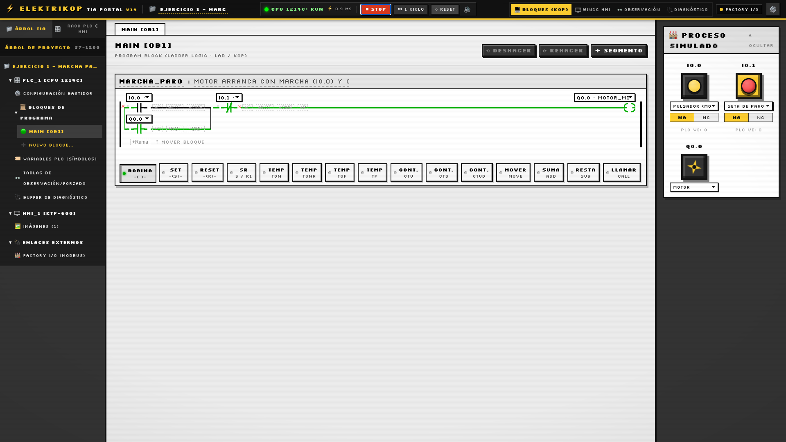

# ElektriKOP

**Emulador de lógica de escalera (KOP / Ladder) para estudiantes de automatización industrial — 100% en español, gratuito y de código abierto.**

   

### 🔗 [Pruébalo ahora en kop.elektrizia.com](https://kop.elektrizia.com) — sin instalar nada

---

## ¿Qué es ElektriKOP?

ElektriKOP es un simulador visual interactivo de lógica de escalera (KOP / Ladder Diagram) inspirado fielmente en el entorno de programación de un PLC **Siemens SIMATIC S7-1200** y **TIA Portal**. Permite diseñar segmentos de automatización completos —contactos, bloques lógicos, temporizadores, contadores, operaciones numéricas, subrutinas FC/FB y pantallas HMI— visualizando en tiempo real el flujo de corriente (RLO) por el circuito sin requerir costosas licencias, potentes ordenadores con Windows ni hardware físico.

Está especialmente diseñado para **estudiantes de ciclos formativos de Formación Profesional** (Automatización y Robótica Industrial, Mecatrónica, Mantenimiento Electrónico, Instalaciones Electrotécnicas) y certificados de profesionalidad (como **ELEE0109**), profesores técnicos que buscan una herramienta ágil para el aula, y cualquier persona que desee comprender la lógica de control antes de enfrentarse al software industrial real.

## Por qué existe

TIA Portal es el estándar indiscutible de la industria, pero impone importantes barreras de acceso:
- Licencias comerciales o de campus limitadas.
- Instalaciones pesadas (~40 GB) y soporte exclusivo para sistemas Windows.
- Curva de aprendizaje empinada para alumnos que dan sus primeros pasos en lógica cableada y programada.

ElektriKOP no busca sustituir a TIA Portal en una planta real, sino ser su **compañero pedagógico ideal**: un espacio donde equivocarte sin riesgo, entender por qué falla un enclavamiento, conectar con un gemelo digital 3D y ganar intuición sólida sobre la ejecución cíclica de un autómata.

---

## 📚 Documentación y Guías

- 📖 [**Guía Didáctica de Funciones TIA Portal**](docs/guia-tia-portal-elektrikop.md) — Explicación pedagógica de NOT, marcas de reloj/sistema (MB1), Startup [OB100], MOVE, TONR, operaciones matemáticas y casos de uso industrial.
- 🖥️ [**Manual del Diseñador HMI**](docs/hmi/README.md) — Creación de pantallas táctiles industriales con chasis Siemens SIMATIC, bargraphs, pilotos y variables enlazadas.
- 🏭 [**Puente con Factory I/O**](bridge/README.md) — Conexión WebSocket ⇄ Modbus TCP para controlar escenas 3D industriales reales y modo Mock para macOS/Linux.
- 🎯 [**Ejercicios y Desafíos Prácticos**](docs/ejercicios/README.md) — 8 proyectos progresivos resueltos con enunciados didácticos y ficheros importables.

---

## Características Principales

### 1. Editor KOP y Motor de Scan Industrial
- **Topología libre**: Segmentos con contactos en serie y en paralelo anidados sin límite artificial de profundidad.
- **Tipos de contacto**: Normalmente Abierto (NA), Normalmente Cerrado (NC), Detección de Flanco Positivo (P) y Flanco Negativo (N), alternables con un solo clic.
- **Inversor de flujo lógico `--[NOT]--`**: Invierte el Resultado de la Operación Lógica (RLO) acumulado en cualquier punto del segmento o tras una red en paralelo.
- **Bobinas y biestables**: Bobina directa `( )`, SET `(S)`, RESET `(R)` y **bloque combinado SR / RS** con prioridad configurable (dominancia de Set o Reset) y ramas de entrada independientes.
- **Temporizadores IEC**: `TON` (retardo a la conexión), `TOF` (retardo a la desconexión), `TP` (pulso) y **`TONR` (retentivo/acumulador pausable)** con entrada secundaria de Reset.
- **Contadores IEC**: `CTU` (adelante), `CTD` (atrás) y **`CTUD` (bidireccional)** con pines CU, CD, QU, QD y rama de contactos lógicos para Reset y Carga.
- **Operaciones numéricas**:
  - Bloque **`MOVE`** para transferir constantes o valores de variables hacia salidas analógicas o memorias.
  - Bloques aritméticos **`ADD`** (suma) y **`SUB`** (resta) con habilitación lógica `EN`.
- **Comparadores numéricos (`+CMP`)**: Evalúan magnitudes analógicas (`IW0`), tiempos de temporizadores (`ET`, `PT`) o cuentas (`CV`) con operadores `>`, `<`, `>=`, `<=`, `==` y `<>`.
- **Flujo de corriente en vivo**: Visualización animada en verde del RLO a lo largo de los conductores y bloques.
- **Arrastrar y soltar (Drag & Drop)**: Desplaza contactos o cambia salidas arrastrando elementos directamente en el esquema.

### 2. Arquitectura y Modularidad Siemens
- **Ciclo Principal: `Main [OB1]`**: Bloque de organización cíclico ejecutado continuamente por el autómata.
- **Bloque de Arranque: `Startup [OB100]`**: Rutina de inicialización ejecutada una única vez al pasar de STOP a RUN (ideal para inicializar etapas Grafcet, cargar recetas o resetear contadores).
- **Bloques de Función (FC)**: Funciones modulares con interfaz IN/OUT, llamables desde Main u otros FCs sin retención de estado entre llamadas.
- **Bloques de Función con Memoria (FB)**: Bloques con interfaz enriquecida que soportan parámetros **STATIC** (memoria de instancia propia persistente entre ciclos para cada sitio de llamada, sin requerir DBs manuales).
- **Independencia de instancias**: Múltiples llamadas al mismo bloque mantienen temporizadores, contadores y flancos internos completamente aislados.

### 3. Memoria, E/S y Señales Analógicas
- **E/S Físicas Digitales**: 10 entradas digitales (`I0.0`–`I0.9`) y 10 salidas digitales (`Q0.0`–`Q0.9`).
- **Cableado Físico NA/NC**: Configuración de sensores normalmente abiertos o normalmente cerrados a nivel de borna real (p. ej. setas de emergencia o finales de carrera NC), distinguiendo el cableado físico del contacto lógico en el programa.
- **Memoria de Marcas (M)**:
  - **`MB0` (`M0.0` a `M0.7`)**: Marcas internas de usuario para etapas, memorias auxiliares e interbloqueos.
  - **`MB1` (Marcas de Sistema y Reloj Siemens)**:
    - `M1.0` (`FirstScan`): Activo exclusivamente durante el primer scan.
    - `M1.2` (`AlwaysTRUE`): Siempre a 1 lógico.
    - `M1.3` (`AlwaysFALSE`): Siempre a 0 lógico.
    - `M1.5` (`Clock_0.5Hz`): Señal oscilante de 2 segundos (balizas lentas).
    - `M1.6` (`Clock_2Hz`): Señal oscilante rápida de 0.5 segundos (preavisos o alarmas críticas).
    - `M1.7` (`Clock_1Hz`): Señal oscilante de 1 segundo para luces de aviso y señalización.
- **Señales Analógicas**:
  - Entrada analógica **`IW0`** (0–100) ajustable desde el simulador.
  - Salida analógica **`QW0`** para consignas numéricas o variadores de velocidad.

### 4. Diseñador y Visualizador HMI (Siemens SIMATIC)
- **Pantallas HMI Multiventana**: Entorno de diseño visual WYSIWYG para crear cuadros de mando de operador.
- **Chasis Industrial SIMATIC**: Pantalla enmarcada en una carcasa retro inspirada en los terminales **Siemens SIMATIC KTP-600** con tornillos de fijación, LEDs de hardware (PWR, RUN, ALARM) y botones táctiles funcionales F1–F4.
- **Componentes con enlace directo (Bindings)**:
  - Pulsadores momentáneos y conmutadores biestables vinculados a entradas/marcas.
  - Lámparas piloto con personalización de color y **modo alarma parpadeante**.
  - Visualizadores de temporizadores en tiempo real (progreso gráfico, `ET` transcurrido y `PT` consigna).
  - Visualizadores de contadores con barra de llenado (`CV` / `PV`).
  - **Bargraph analógico Siemens**: Indicador de nivel analógico horizontal o vertical con escalas configurables.

### 5. Gemelo Digital 3D: Conexión con Factory I/O
- **Puente Industrial (`bridge/`)**: Servidor ligero Node.js que traduce comunicaciones **WebSocket ⇄ Modbus TCP (Puerto 502)**.
- **Control de Plantas 3D**: Conecta ElektriKOP con el simulador 3D industrial **Factory I/O** para controlar cintas transportadoras, barreras, clasificadores por altura o células de paletizado.
- **Modo Simulación (Mock)**: ¿No tienes Windows ni Factory I/O instalado? El puente incluye un gemelo digital por software que simula una cinta con sensor óptico y telemetría en vivo, compatible con macOS y Linux.

### 6. Diagnóstico y Herramientas de Campo
- **Búfer de Diagnóstico (Diagnostic Buffer)**: Visor de eventos cronológico similar al de TIA Portal que registra arranques de OB100, transiciones RUN/STOP y fallos de proceso.
- **Tabla de Observación y Forzado (Watch & Force Table)**: Monitorea todas las variables del PLC y fuerza valores lógicos o analógicos directamente para labores de puesta en marcha.
- **Bastidor Siemens S7-1200**: Representación gráfica del autómata con regleteros de conexión iluminados y LEDs de estado de CPU (RUN/STOP, ERROR, MAINT).

### 7. Proceso Simulado y HMI Rápido
- **Gemelo 2D en barra lateral**: Visualización inmediata de actuadores asignados a las variables (motores, cintas, cilindros neumáticos, puertas, alarmas sonoras).
- **Atajos de teclado instantáneos**: Pulsa las teclas `0` a `9` para activar o mantener pulsadas las entradas físicas sin soltar el ratón del editor de contactos.

### 8. Modo Desafío y Gestión de Proyectos
- **Autocorrección de Retos**: Valida automáticamente si tu circuito cumple con las especificaciones de comportamiento esperadas ciclo a ciclo, sin imponer una única forma de cablear el circuito.
- **Tabla de Variables Simbólicas**: Asigna nombres descriptivos (p. ej. `Marcha_Cinta`, `Sensor_Nivel`) antes o durante el diseño.
- **Autoguardado y Seguridad**: Autoguardado continuo cada 800 ms en el almacenamiento local del navegador, historial de Deshacer / Rehacer de 50 pasos (Ctrl+Z / Ctrl+Y), exportación e importación JSON y generación de enlaces directos para compartir circuitos completos por URL.

---

## Capturas



---

## Cómo Empezar

### Uso Inmediato en la Web
Entra en **[kop.elektrizia.com](https://kop.elektrizia.com)** desde cualquier navegador moderno (Chrome, Firefox, Safari, Edge en Windows, Mac, Linux o tablets). No requiere instalación ni registros; todo se ejecuta en local en tu navegador.

### Instalación en Local

Si deseas clonar el proyecto para desarrollo o uso sin conexión:

```bash
# 1. Clonar el repositorio
git clone https://github.com/mrzuzo90/elektriKOP.git
cd elektriKOP

# 2. Instalar dependencias
npm install

# 3. Iniciar servidor de desarrollo Vite
npm run dev
```

Abre `http://localhost:5173` en tu navegador.

Para ejecutar los tests automatizados y comprobar la integridad del código:
```bash
npm test         # Ejecuta la suite de pruebas unitarias con Vitest (209 tests)
npm run lint     # Comprueba el código con oxlint (0 warnings)
npm run build    # Genera el bundle optimizado de producción en dist/
```

---

## Guía Rápida de Uso

1. **Añadir Segmentos**: Haz clic en **+ Segmento** en el bloque activo (`Main [OB1]`).
2. **Cablear Lógica**: Inserta contactos en serie (`+C`), ramas en paralelo (`+P`), inversores (`+NOT`) o comparadores analógicos (`+CMP`).
3. **Configurar Contactos**: Haz clic sobre cualquier contacto para conmutar entre NA, NC, flanco P o flanco N.
4. **Definir Salidas**: Selecciona en el extremo derecho el tipo de instrucción: Bobina directa, SET, RESET, biestable SR/RS, temporizadores (TON, TOF, TP, TONR), contadores (CTU, CTD, CTUD) o bloques de cálculo (MOVE, ADD, SUB).
5. **Simular**:
   - Pulsa **RUN** para scan continuo (100 ms).
   - O pulsa **1 CICLO** para avanzar paso a paso y observar la propagación del RLO en cada escaneo.
6. **Actuar sobre las Entradas**: Interactúa mediante los botones del HMI, los dispositivos del Proceso Simulado o usando las teclas numéricas `0`–`9`.
7. **Diseñar Pantallas HMI**: Abre la vista **HMI**, pulsa **Editar HMI** y coloca pilotos, displays y barras vinculados a tus marcas o salidas.
8. **Conectar con Factory I/O**: Inicia el puente en `bridge/` (`npm start` o `npm run mock`) y conecta desde el panel lateral para controlar escenas 3D.

---

## Retos y Ejercicios Propuestos

En [`docs/ejercicios/`](docs/ejercicios/) se incluye una serie completa de retos graduados por dificultad, acompañados de su enunciado teórico, pistas y solución `.json` oficial:

| # | Ejercicio | Dificultad | Conceptos clave |
| :-: | :-------- | :--------: | :-------------- |
| 1 | [Marcha/Paro con enclavamiento](docs/ejercicios/01-marcha-paro-enclavamiento/enunciado.md) | ⭐ | Contactos NA/NC, bobina directa, retroalimentación lógica |
| 2 | [Semáforo con temporizadores](docs/ejercicios/02-semaforo-temporizadores/enunciado.md) | ⭐⭐ | Temporizadores TON encadenados, fases cíclicas |
| 3 | [Puerta automática con finales de carrera](docs/ejercicios/03-puerta-automatica-finales-carrera/enunciado.md) | ⭐⭐⭐ | Interbloqueos cruzados, cableado físico NC vs lógica de programa |
| 4 | [Dos cintas con arranque temporizado (FC)](docs/ejercicios/04-cintas-transportadoras-fc/enunciado.md) | ⭐⭐⭐ | Subrutinas FC modulares, parámetros IN/OUT, llamadas independientes |
| 5 | [Contador de piezas con marca interna](docs/ejercicios/05-contador-piezas-marca/enunciado.md) | ⭐⭐ | Contador CTU, ramal de reset por contacto, marcas auxiliares de usuario |
| 6 | [Tanque con sensor analógico y comparadores](docs/ejercicios/06-tanque-nivel-comparador/enunciado.md) | ⭐⭐⭐ | Señales analógicas (IW0), comparadores numéricos (+CMP), control por histéresis |
| 7 | [Alternador con bloque FB (memoria STATIC)](docs/ejercicios/07-alternador-fb-static/enunciado.md) | ⭐⭐⭐ | Bloques FB, parámetros STATIC con retención por instancia |
| 8 | [Control de acceso a garaje con CTUD](docs/ejercicios/08-control-acceso-garaje-ctud/enunciado.md) | ⭐⭐ | Contador bidireccional CTUD, entradas CU/CD, aforo y telemetría |

---

## Estado del Proyecto y Roadmap

- [x] Motor de scan determinista e independiente (puro JS).
- [x] Editor visual KOP con contactos NA, NC, flancos P/N y ramas paralelas anidadas.
- [x] Inversor de flujo lógico `--[NOT]--`.
- [x] Bobinas directas, SET, RESET y biestable SR/RS con ramas lógicas dedicadas.
- [x] Temporizadores IEC: TON, TOF, TP y retentivo TONR con pin de reset.
- [x] Contadores IEC: CTU, CTD y CTUD bidireccional con ramal de reset/carga.
- [x] Comparadores numéricos analógicos y sobre variables de tiempo/conteo.
- [x] Operaciones numéricas MOVE, ADD y SUB con habilitación EN/ENO.
- [x] Bloque de organización de arranque `Startup [OB100]`.
- [x] Modularidad industrial con bloques FC y bloques FB (variables STATIC).
- [x] Marcas de memoria de usuario (MB0) y marcas de reloj/sistema Siemens (MB1).
- [x] Salida analógica QW0 y entrada analógica IW0.
- [x] Diseñador y runtime HMI completo con chasis SIMATIC KTP-600 y componentes vivos.
- [x] Puente WebSocket ⇄ Modbus TCP para gemelos digitales en Factory I/O (con modo Mock).
- [x] Búfer de diagnóstico y tabla de observación y forzado (Watch & Force Table).
- [x] Modo Desafío con autograding algorítmico ciclo a ciclo.
- [x] Compartir proyectos mediante URL comprimida sin almacenamiento en servidor.
- [x] Suite de 209 tests unitarios automatizados.

### Líneas futuras de investigación / mejoras abiertas:
- [ ] Exportador de lógica a texto estructurado (SCL / IEC 61131-3 Structured Text).
- [ ] Soporte táctil optimizado para tablets educativas en arrastrar y soltar.
- [ ] Tour interactivo guiado para nuevos estudiantes.

---

## Contribuir

¡Las aportaciones de la comunidad son bienvenidas! Si eres profesor, estudiante o profesional del sector:
- Comparte nuevos enunciados y retos industriales para `docs/ejercicios/`.
- Propón mejoras de usabilidad en el editor o reporte de casos borde en la simulación.
- Abre un *Pull Request* o inicia una discusión en los *Issues* de GitHub.

---

## Licencia

Este proyecto se distribuye bajo la **Licencia MIT**. Es libre para su uso en aulas, institutos, centros de formación técnica y proyectos personales.

## Autor

Creado y mantenido por **Zuzo** ([@mrzuzo90](https://github.com/mrzuzo90)) a partir del estudio práctico del certificado de profesionalidad ELEE0109, con el firme compromiso de ofrecer recursos didácticos abiertos, accesibles y de calidad para la formación técnica en automatización.